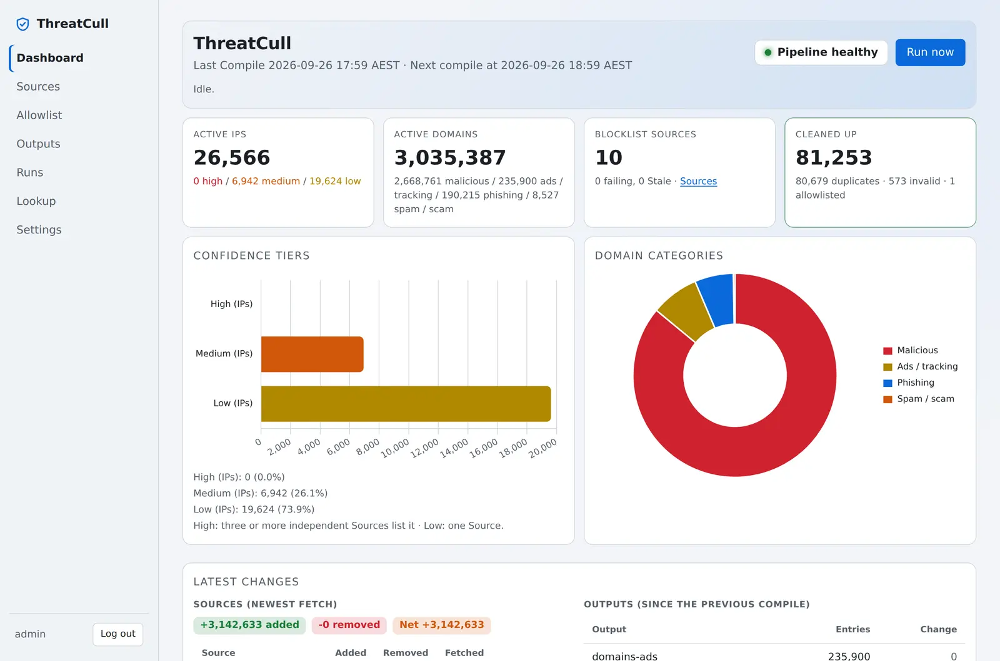
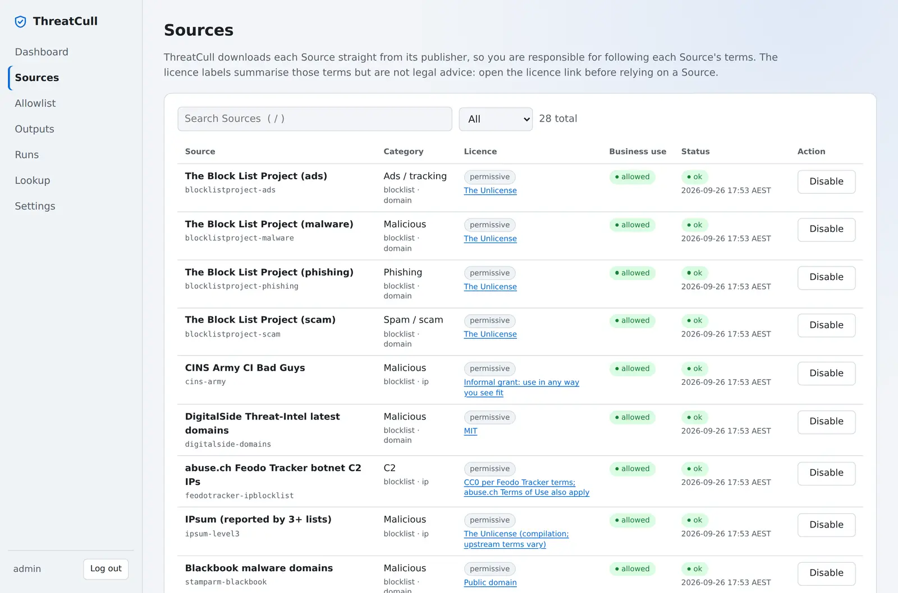
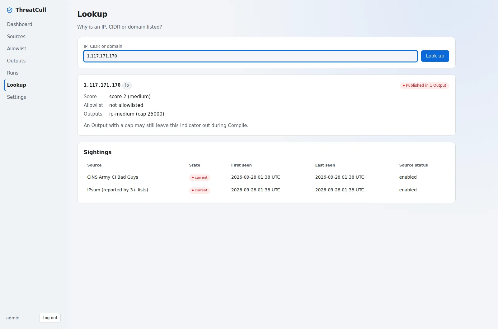

# ThreatCull

[](https://github.com/spydisec/threatcull/releases/latest)
[](https://coderabbit.ai)
[](https://github.com/spydisec/threatcull/actions/workflows/image-scan.yml)
[](https://github.com/spydisec/threatcull/pkgs/container/threatcull)
[](pyproject.toml)
[](LICENSE)
[](https://deepwiki.com/spydisec/threatcull)

Self-hosted threat-feed compiler. ThreatCull downloads public blocklists, drops duplicates, private
ranges and your own infrastructure, scores each indicator by how many independent sources list it, and
serves the result to your firewalls, DNS servers and SIEM.

```text
sources ──> drop duplicates, private ranges, your allowlist ──> score by source agreement ──> feed URLs
```

- [Catalog](docs/CATALOG.md) of blocklist sources with licence details, plus your own sources (URL or local file)
- Built-in CDN allowlists, your own entries and your own allowlist URLs; mark your own network to
  get an alert when a source lists it
- Confidence tiers (high, medium, low) from source agreement
- Outputs as plain, hosts, AdGuard, RPZ, CSV or JSON, each at its own URL with a Feed Token
- Web UI with a dashboard, lookup, run history and a built-in scheduler
- Works offline and on a bare LAN IP

<table>
  <tr>
    <td width="33%" align="center">
      <a href="docs/images/dashboard-light.webp"><picture><source media="(prefers-color-scheme: dark)" srcset="docs/images/dashboard-dark.webp"></picture></a>
      <br><sub><b>Dashboard</b></sub>
    </td>
    <td width="33%" align="center">
      <a href="docs/images/sources-light.webp"><picture><source media="(prefers-color-scheme: dark)" srcset="docs/images/sources-dark.webp"></picture></a>
      <br><sub><b>Sources and licences</b></sub>
    </td>
    <td width="33%" align="center">
      <a href="docs/images/lookup-light.webp"><picture><source media="(prefers-color-scheme: dark)" srcset="docs/images/lookup-dark.webp"></picture></a>
      <br><sub><b>Lookup</b></sub>
    </td>
  </tr>
</table>

<sub>Click a screenshot to open it full size.</sub>

## Quick start

You need Docker with Compose. The image is published for amd64 and arm64.

```bash
curl -fsSLO https://raw.githubusercontent.com/spydisec/threatcull/main/docker-compose.yaml
```

Set `THREATCULL_ADMIN_PASSWORD` in `docker-compose.yaml` (12 or more characters), then:

```bash
docker compose up -d
```

Open `http://<server-ip>:6969` and log in as `admin`. ThreatCull reads the password on the first
start only; you can clear it from the file afterwards. Data lives on the `threatcull-data` volume.

**Portainer:** Stacks > Add stack, paste `docker-compose.yaml`, set the password, Deploy.

## First steps

1. On **Sources**, enable the lists you want.
2. On **Outputs**, rotate a Feed Token to get the feed URL. Tokens show once.
3. Click **Run now**, or wait for the hourly schedule.
4. Point your firewall or DNS server at the feed URL:

```bash
curl http://<server-ip>:6969/o/ip-high/<feed-token>
```

## Settings

Set these under `environment:` in `docker-compose.yaml`.

| Variable | Default | What it does |
|---|---|---|
| `THREATCULL_ADMIN_PASSWORD` | none | Creates the `admin` user on the first start (12 or more characters) |
| `THREATCULL_ADMIN_PASSWORD_FILE` | none | Same, read from a file such as a Docker secret; wins over the above |
| `TZ` | `UTC` | Timezone for times in the web UI, as an IANA name such as `Australia/Melbourne` |

ThreatCull stores and schedules everything in UTC, so you can change `TZ` at any time. Hover a time
in the web UI to see its UTC value.

## Upgrade

```bash
docker compose pull && docker compose up -d
```

The `:1` tag follows 1.x releases. Pin a version such as `:1.0.0` to upgrade by hand. Sources you
disabled stay disabled.

**Catalog only:** to pick up new or corrected sources between releases, use **Check for updates**
on the Sources page, or run `threatcull catalog update`. New sources arrive disabled. Without
internet access, upload a newer `catalog.yaml` there, or run `threatcull catalog update --file`.

## Back up and restore

```bash
docker compose run --rm -T threatcull config export > threatcull-config.yaml
docker compose run --rm -T threatcull config import - < threatcull-config.yaml
```

The file holds settings, source choices, the allowlist and outputs. It holds no passwords,
tokens or threat data. **Settings > Configuration** in the web UI does the same. For a full backup,
copy the `threatcull-data` volume.

## Run without Docker

```bash
git clone https://github.com/spydisec/threatcull.git && cd threatcull
uv sync
uv run threatcull init
uv run threatcull user create admin
uv run threatcull serve --host <lan-ip> --port 6969
```

`init` prints each default output's Feed Token once. `uv run threatcull --help` lists every command.

## Notes

- **Offline networks:** add a custom source with a `file://` URL. Sources added in the web UI must
  point to files in `data/imports/`.
- **Ranges:** outputs list single IP addresses and domains. A source that lists a CIDR range counts on
  the dashboard as "Ranges left out", because one range can block many unrelated hosts. Ranges on
  the allowlist still cover every address inside them.
- **Your network:** add your public addresses to the allowlist with **My network** ticked (or run
  `threatcull allow detect`). ThreatCull keeps them out of every output and warns you when a source
  lists one.
- **Scripts:** create an API token with `threatcull api-token create <name> --user admin` and send it
  as `Authorization: Bearer <token>` to `/api/v1/`.
- **Hardening:** the container runs as a non-root user, and the compose file drops all Linux
  capabilities and blocks privilege escalation. It also works with `read_only: true` and
  `tmpfs: [/tmp]`.
- **Reverse proxy with TLS:** start `serve` with `--secure-cookies` and `--trusted-proxy <proxy-ip>`.
- **Scheduling:** `serve` runs fetches and compiles itself. Don't also run `threatcull run` from `cron`
  on the same data directory.

## Sources and licences

ThreatCull ships no threat data. Each install downloads every source from its publisher, so you accept
each source's terms. The Sources page shows each licence and links to its terms; read them before you
rely on a source. Serving outputs to your own devices is your own use; sharing a feed URL with another
organisation passes the data on, which many licences forbid.

## Development

```bash
make setup   # dependencies and git hooks
make check   # lint, types and security checks, as in CI
```

See [CONTRIBUTING.md](CONTRIBUTING.md) for issues and pull requests, [SECURITY.md](SECURITY.md)
to report a vulnerability, and [CHANGELOG.md](CHANGELOG.md) for what changed in each release.

## Licence

[GNU AGPL-3.0](LICENSE)
